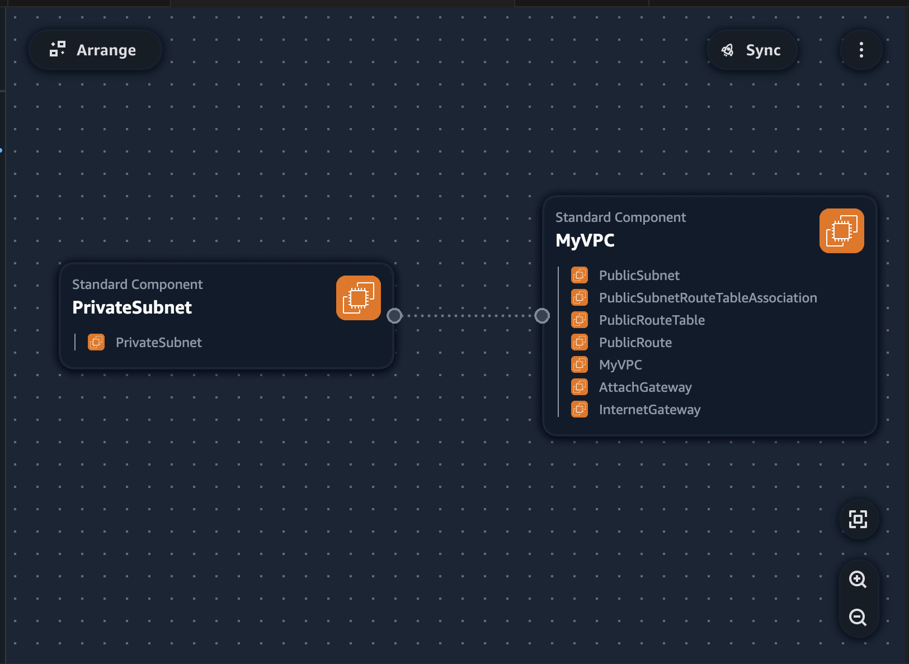
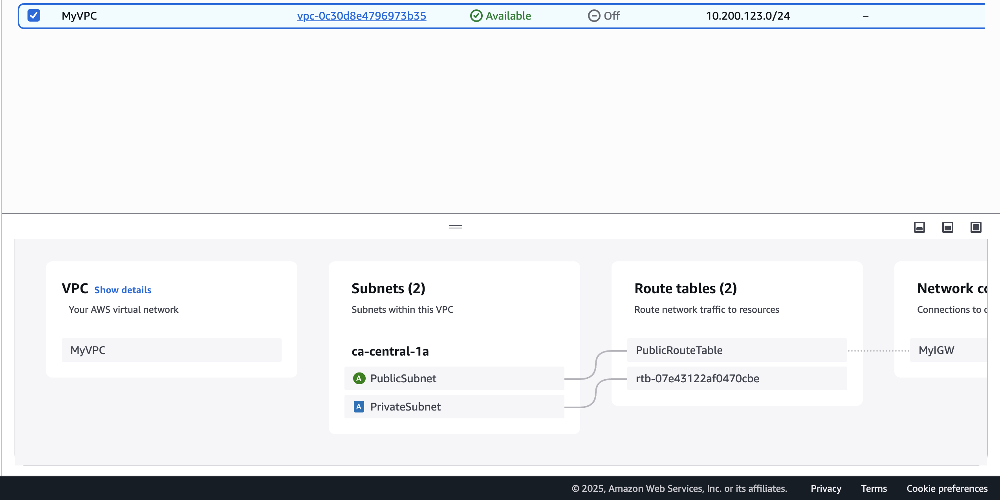

## VPC Settings

These are the VPC Settings we observed Tim setup for our cloud environment in AWS:

- VPC IPv4 CIDR Block: 10.200.123.0/24
- IPv6 CIDR Block: None
- Number of AZs: 1 
- Number of Public Subnets: 1
- Number of Provate Subnets: 1
- NAT Gateways: None
- VPC Endpoints: None
- DNS Options: Enable DNS Hostnames
- DNS Options: Enable DNS Resolution

## Generated and Reviewed CFN Template

Watching the instructors videos, I noted the VPC settings, provided this to the LLM to produce the CFN template to automate tje provisioning of VPC infrastrucute.

- I had to ask the LLM to refactor the parameters so that it would not hardcode the values and the template is more reusable.

## Generated Deployment Script

Using LLM generated a bash script `bin/deploy`.

I changed the shebang to work across all OS platforms.

## Visualization in Infrastrucutre Composer

## Install AWS CLI

In order to deploy via the AWS CLI, we need to install it.

We follow the install instructions:
https://docs.aws.amazon.com/cli/latest/userguide/getting-started-install.html

## Deployed Resource to AWS

This is the resource map of the VPC deployed with CFN.

